# Лабораторна робота 6
## Завдання:
### 1. Продемонстувати використання HashSet i hashCode().
### 2. Продемонстувати використання TreeSet i Comparable.
### 3. Продемонстувати використання TreeMap.
### 4. Продемонстувати використання LinkedList.
### 5. Продемонстувати використання ArrayList.
### 6. Продемонстувати використання Queue.
### 7. Продемонстувати використання PriorityQueue.

## HashSet i hashCode()
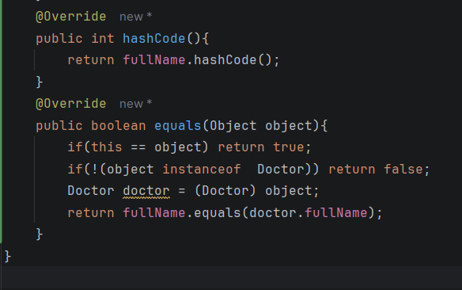
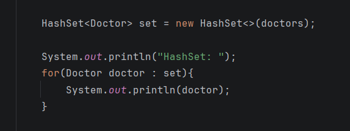

## TreeSet i Comparable
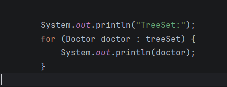
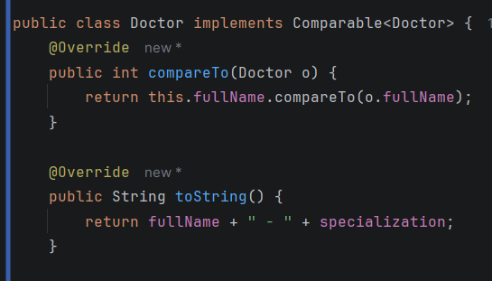
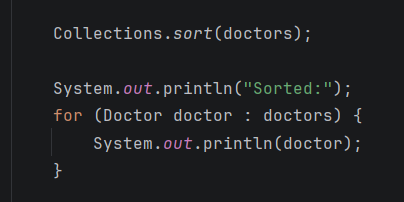

## TreeMap
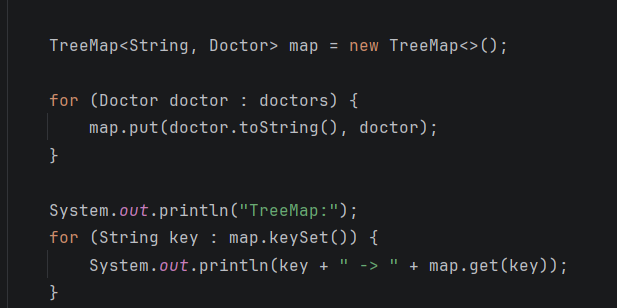

## LinkedList
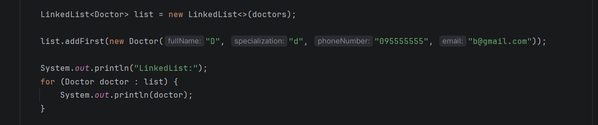

## ArrayList
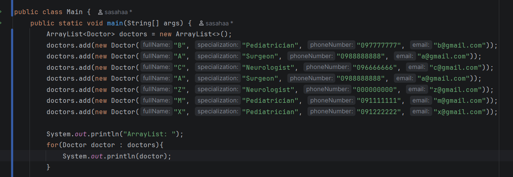

## Queue
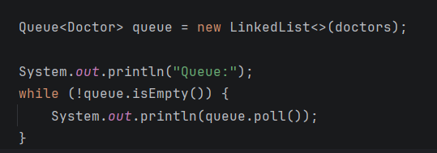

## PriorityQueue
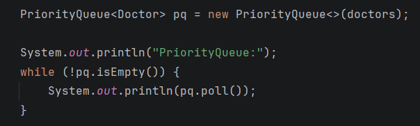

## Result
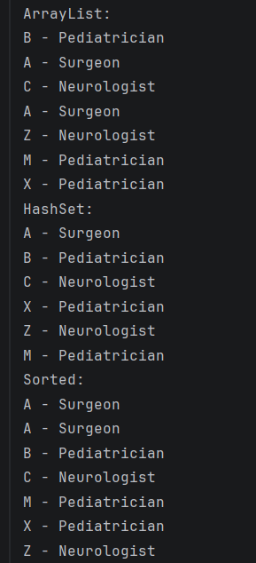
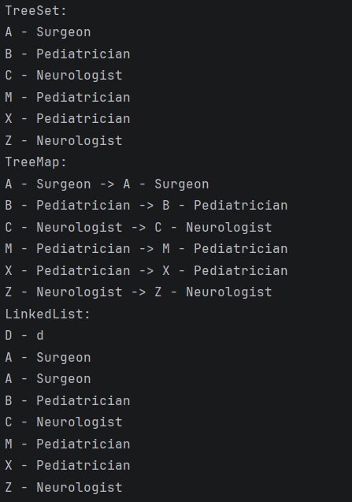
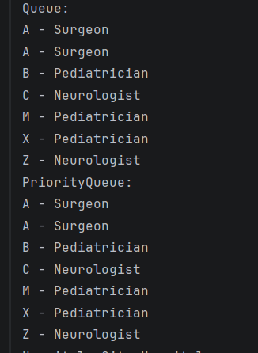

